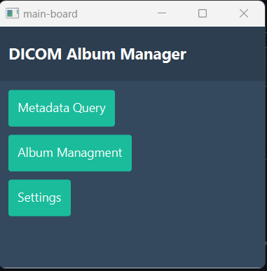
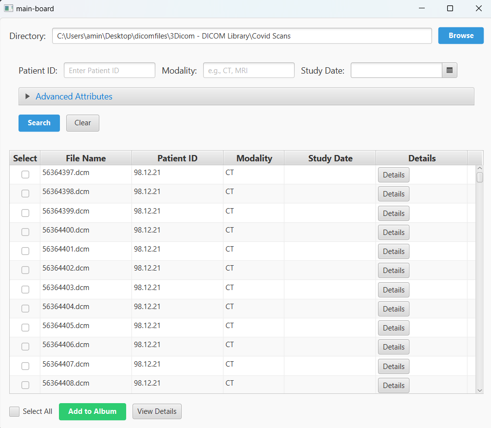
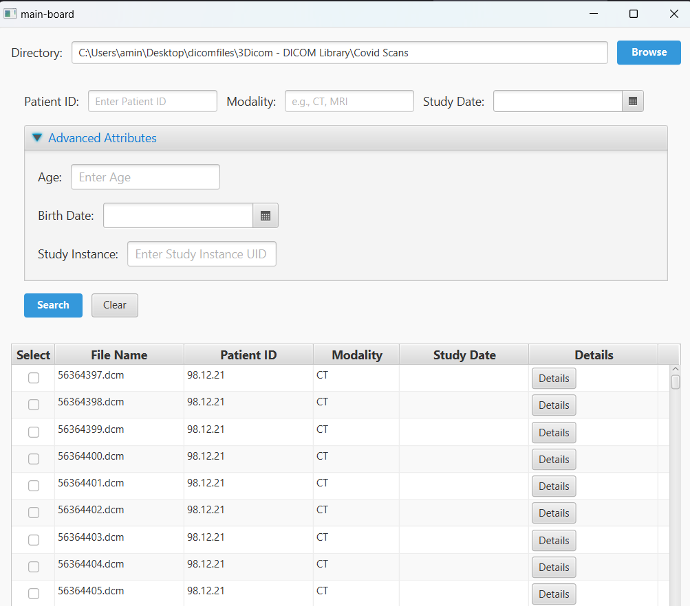
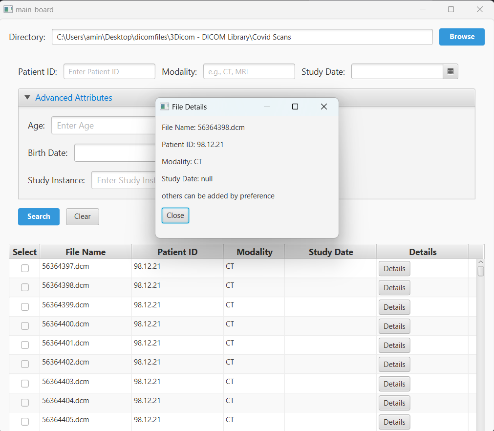
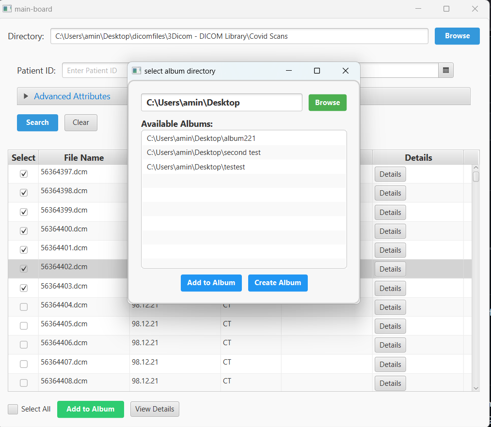
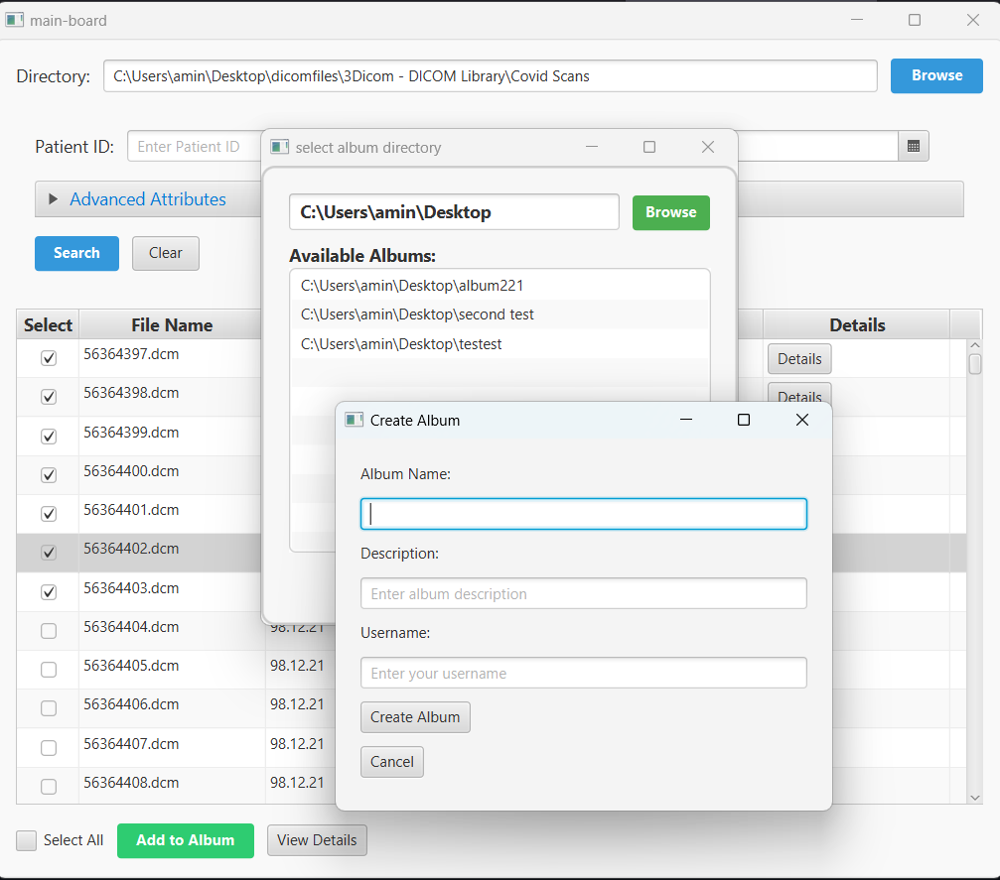
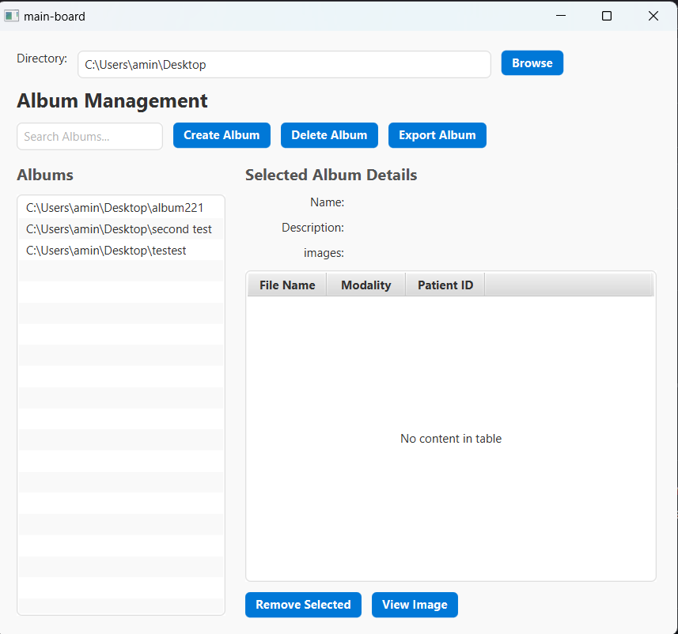
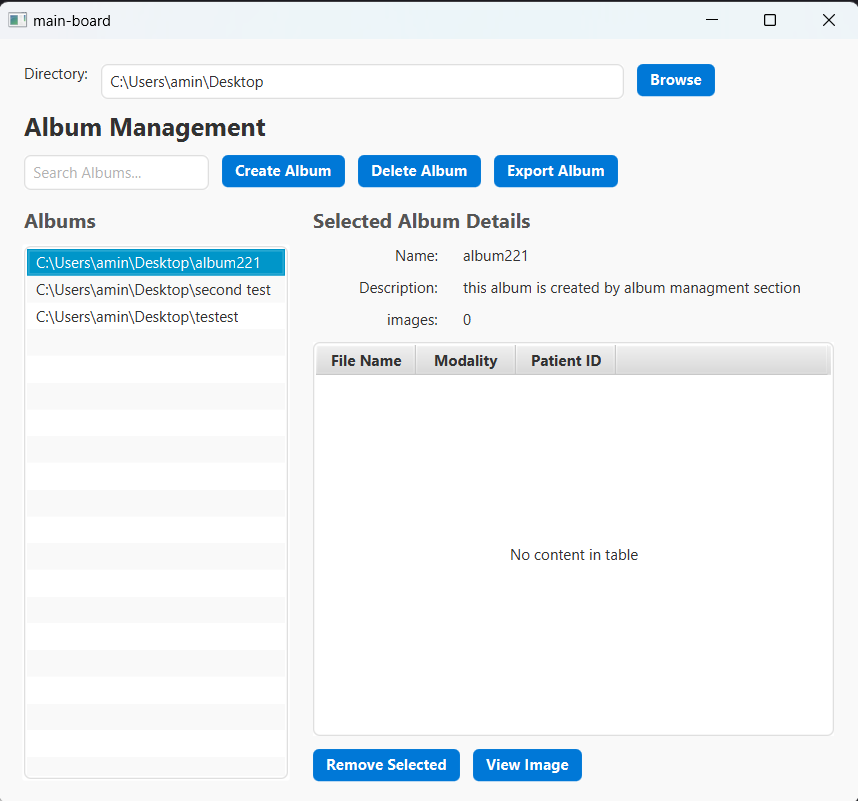
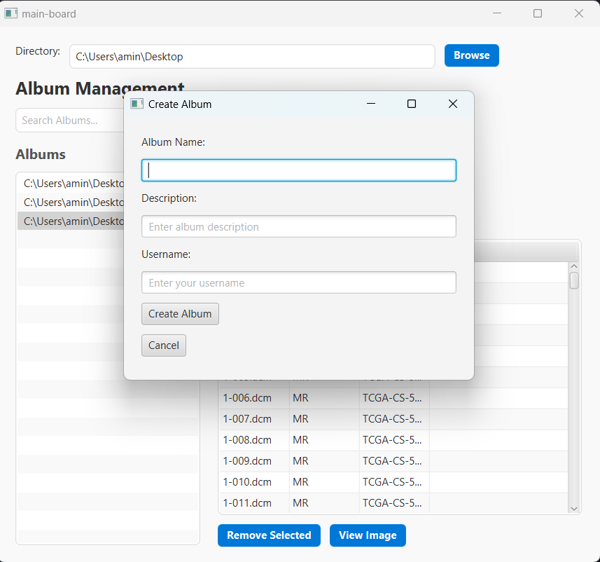

# **Language Selection**
- [English](#dicom-album-management-tool)
- [Français](#outil-de-gestion-des-albums-dicom)
- [Screenshots / Captures d'ecran](Screenshots-/-Captures-d'ecrans)
---

# **DICOM Album Management Tool**  
This project involves the creation of a tool designed to simplify the management of DICOM images, particularly the creation of albums from subsets of DICOM images. The primary goal is to streamline researchers' workflows by automating medical data management and enabling the extraction and searching of DICOM metadata.

## **What is DICOM?**
DICOM (Digital Imaging and Communications in Medicine) is a standard used for the exchange, storage, and transmission of medical images and associated information. It is widely used in hospitals, clinics, and research institutes for storing and analyzing medical images such as X-rays, CT scans, MRIs, ultrasounds, and more.

### **Features of the DICOM Format:**
- **Medical Images**: DICOM is used to represent images from medical equipment such as scanners, MRI machines, ultrasound devices, etc.
- **Metadata**: In addition to images, DICOM files contain metadata that describes the patient, exam parameters, image type, etc.
- **Interoperability**: DICOM enables different computer systems from various manufacturers to communicate and exchange data uniformly.

## **Who Uses DICOM?**
- **Doctors and Radiologists**: Healthcare professionals use DICOM images to diagnose and analyze patients' medical conditions.
- **Medical and Imaging Researchers**: Researchers working on medical image analysis use DICOM to process and analyze large amounts of imaging data.
- **Developers and Medical Software Engineers**: Developers create tools and software to manage, store, and analyze DICOM data.
- **Hospitals and Clinics**: These institutions use DICOM to store medical images in their Picture Archiving and Communication Systems (PACS).

## **Project Description**
This tool is designed to allow researchers and healthcare professionals to create, manage, and manipulate albums from locally stored DICOM images. The main features include:
- **Metadata Query**: Enables users to filter DICOM images based on specific metadata (e.g., patient name, exam date, etc.).
- **Album Creation and Management**: Users can organize DICOM images into albums, add or remove images, and manage associated information.
- **Graphical Interface**: The tool provides a user-friendly graphical interface that simplifies interaction with DICOM data.

## **Technologies Used**
- **JavaFX**: For the graphical user interface (GUI), ensuring a smooth user experience.

## **Key Features**
- **DICOM Image Search and Filtering**: Users can search for images based on metadata such as patient name, exam type, etc.
- **Album Creation**: Selected images can be added to an album.
- **Album Management**: Albums can be created, modified, and deleted. Users can add or remove images from albums.
- **Metadata Management**: DICOM image metadata can be displayed and used for queries.

## **Prerequisites**
- **Java Version**: 19
- **Build Tool**: Maven 3.6.0 or higher
- **JavaFX SDK**: Required (included via Maven dependencies)

## **Dependencies**
### **Core Dependencies**
- **JavaFX Controls**: `org.openjfx:javafx-controls:19.0.2`
- **JavaFX FXML**: `org.openjfx:javafx-fxml:19.0.2`
- **DICOM Library**: `org.dcm4che:dcm4che-core:5.23.3`
- **JSON Processing**: `org.json:json:20250107`
- **Jackson Core**: `com.fasterxml.jackson.core:jackson-core:2.13.1`
- **Jackson Databind**: `com.fasterxml.jackson.core:jackson-databind:2.13.1`
- **Jackson Annotations**: `com.fasterxml.jackson.core:jackson-annotations:2.13.1`

### **Testing Dependencies**
- **JUnit 5 API**: `org.junit.jupiter:junit-jupiter-api:5.9.2`
- **JUnit 5 Engine**: `org.junit.jupiter:junit-jupiter-engine:5.9.2`

### **Build Plugins**
- **Maven Compiler Plugin**: `org.apache.maven.plugins:maven-compiler-plugin:3.11.0`
- **JavaFX Maven Plugin**: `org.openjfx:javafx-maven-plugin:0.0.8`

## **Contribution**
Contributions are welcome! If you have suggestions or improvements, feel free to open a **pull request**.

# **Screenshots / Captures d'ecrans**

---

# **Outil de Gestion des Albums DICOM**  
Ce projet consiste en la création d'un outil permettant de faciliter la gestion des images DICOM, notamment la création d'albums à partir de sous-ensembles d'images DICOM. L'objectif principal est de simplifier les workflows des chercheurs en automatisant la gestion des données médicales et en permettant l'extraction et la recherche de métadonnées DICOM.

## **Qu'est-ce que DICOM ?**
DICOM (Digital Imaging and Communications in Medicine) est un standard utilisé pour l'échange, le stockage et la transmission d'images médicales ainsi que des informations associées. Il est largement utilisé dans les hôpitaux, cliniques et instituts de recherche pour le stockage et l'analyse d'images médicales telles que les radiographies, les tomographies, les IRM, les échographies et bien plus encore.

### **Caractéristiques du format DICOM :**
- **Images médicales** : DICOM est utilisé pour représenter des images issues d'équipements médicaux comme les scanners, les appareils IRM, les échographes, etc.
- **Métadonnées** : En plus des images, les fichiers DICOM contiennent des métadonnées qui décrivent le patient, les paramètres de l'examen, le type d'image, etc.
- **Interopérabilité** : DICOM permet à des systèmes informatiques différents, provenant de différents fabricants, de communiquer et d'échanger des données de manière uniforme.

## **Qui utilise DICOM ?**
- **Médecins et Radiologues** : Les professionnels de la santé utilisent les images DICOM pour diagnostiquer et analyser les conditions médicales des patients.
- **Chercheurs en Médecine et en Imagerie Médicale** : Les chercheurs qui travaillent sur l'analyse des images médicales utilisent DICOM pour traiter et analyser de grandes quantités de données d'imagerie.
- **Développeurs et Ingénieurs en Informatique Médicale** : Les développeurs créent des outils et des logiciels permettant de gérer, stocker et analyser les données DICOM.
- **Hôpitaux et Cliniques** : Ces établissements utilisent DICOM pour stocker les images médicales dans leurs systèmes d'archivage et de communication d'images (PACS).

## **Description du projet**
Cet outil est conçu pour permettre aux chercheurs et professionnels de la santé de créer, gérer et manipuler des albums à partir d'images DICOM stockées localement. Les fonctionnalités principales incluent :
- **Requête de métadonnées** : Permet aux utilisateurs de filtrer les images DICOM en fonction de certaines métadonnées (par exemple, le nom du patient, la date de l'examen, etc.).
- **Création et gestion d'albums** : Les utilisateurs peuvent organiser des images DICOM en albums, ajouter ou supprimer des images, et gérer les informations associées.
- **Interface graphique** : L'outil offre une interface graphique conviviale qui facilite l'interaction avec les données DICOM.

## **Technologies utilisées**
- **JavaFX** : Pour l'interface graphique (GUI) permettant une expérience utilisateur fluide.

## **Fonctionnalités principales**
- **Recherche et filtrage des images DICOM** : Les utilisateurs peuvent effectuer des recherches en fonction des métadonnées comme le nom du patient, le type d'examen, etc.
- **Création d'albums** : Les images sélectionnées peuvent être ajoutées à un album.
- **Gestion des albums** : Les albums peuvent être créés, modifiés, et supprimés. Les utilisateurs peuvent ajouter ou supprimer des images des albums.
- **Gestion des métadonnées** : Les métadonnées des images DICOM peuvent être affichées et utilisées pour des requêtes.

## **Prérequis**
- **Version de Java** : 19
- **Outil de construction** : Maven 3.6.0 ou supérieur
- **SDK JavaFX** : Requis (inclus via les dépendances Maven)

## **Dépendances**
### **Dépendances principales**
- **JavaFX Controls** : `org.openjfx:javafx-controls:19.0.2`
- **JavaFX FXML** : `org.openjfx:javafx-fxml:19.0.2`
- **Bibliothèque DICOM** : `org.dcm4che:dcm4che-core:5.23.3`
- **Traitement JSON** : `org.json:json:20250107`
- **Jackson Core** : `com.fasterxml.jackson.core:jackson-core:2.13.1`
- **Jackson Databind** : `com.fasterxml.jackson.core:jackson-databind:2.13.1`
- **Jackson Annotations** : `com.fasterxml.jackson.core:jackson-annotations:2.13.1`

### **Dépendances de test**
- **API JUnit 5** : `org.junit.jupiter:junit-jupiter-api:5.9.2`
- **Moteur JUnit 5** : `org.junit.jupiter:junit-jupiter-engine:5.9.2`

### **Plugins de construction**
- **Maven Compiler Plugin** : `org.apache.maven.plugins:maven-compiler-plugin:3.11.0`
- **JavaFX Maven Plugin** : `org.openjfx:javafx-maven-plugin:0.0.8`

## **Contribution**
Les contributions sont les bienvenues ! Si vous avez des suggestions ou des améliorations à proposer, n'hésitez pas à ouvrir une **pull request**.

---
